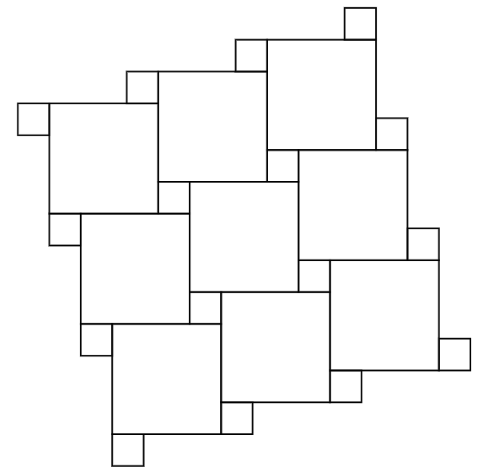
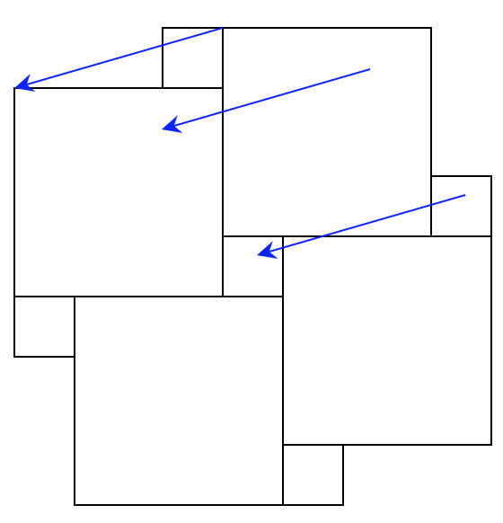

In this post, I'll like to provide two proofs of the Pythagorean theorem which I find elegant and also, don't really require anything other than pictures though, of course, I'll discuss them with words as well. But before that, I'll share a bit of personal history.

It sometimes surprises people to know that I never took a geometry class prior to college despite the fact I'm now a geometer. Somehow, it was arranged that I'd skip geometry and algebra I between middle school and high school and take algebra II in 9th grade. I went to public schools where this seemed really common. In fact, many of my classmates skipped precalculus as well after doing some self-study in the summer. At the end of freshman year, I had a B+ in algebra II so I figured I wasn't that good at math. The next three years, I did not particularly enjoy math; that changed slightly in 12th grade but only marginally. In fact, senior year, I told my classmates that I was interested in majoring in engineering in college and then said, "But I really don't like math." They warned me that engineering would require me to do a lot of math, similar to high school. Good thing I didn't major in engineering; I would not have enjoyed doing math like in high school!

Note that

